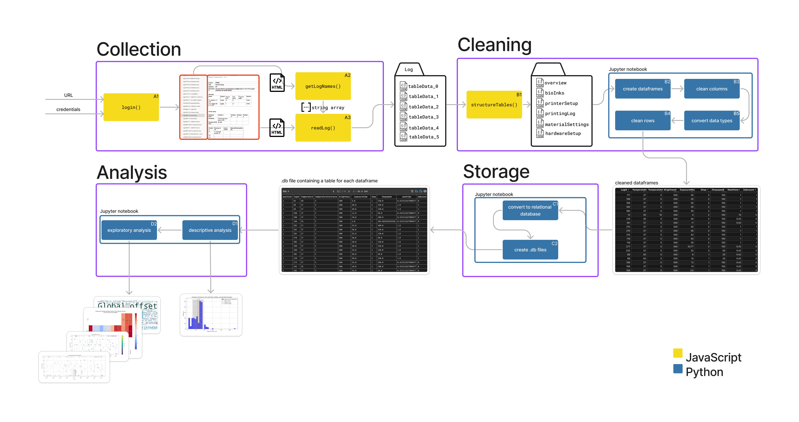

# Bioprinting Data Processing Pipeline

Migration of OneNote bioprinting logs into an analyzable, queryable format.

This project takes several years' worth of hand-written laboratory records - kept as
tables inside a shared Microsoft OneNote notebook — and turns them
into a normalized SQLite database that can be queried and statistically analyzed.

It is a research/thesis project, not a packaged tool. The code is a pipeline you walk
through stage by stage, and each stage leaves inspectable artifacts on disk before the
next one picks them up. 

This is an overview of the whole pipeline:


---

## Table of contents

1. [The problem](#1-the-problem)
2. [Repository Map](#2-repository-map)
3. [Stage A — Acquisition (scraping OneNote)](#stage-a--acquisition-scraping-onenote)
4. [Stage B1 — Structuring the raw tables](#stage-b1--structuring-the-raw-tables)
5. [Stage B2–B5 — Cleaning into DataFrames](#stage-b2b5--cleaning-into-dataframes)
6. [Stage C — Data storage (SQLite)](#stage-c--data-storage-sqlite)
7. [Stage D — Analysis](#stage-d--analysis)
8. [Known issues and caveats](#known-issues-and-caveats)
9. [Glossary](#glossary)

---

## 1. The problem

Each bioprinting experiment was documented as one OneNote **page**. A page contains up
to six HTML tables, each describing a different facet of the experiment:

| Table | What it records |
|---|---|
| **Overview** | Log number, title, operator(s), free-text description |
| **Bioinks** | Ink name, polymer, polymer concentration, LAP and tartrazine concentration, solvent |
| **Material Settings** | Per-slot printer parameters (temperature, brightness, exposure time, z-hop, wash time…) — often stored as a JSON blob inside a single cell |
| **Printer Setup** | Links to `.stl` files |
| **Hardware Setup** | Which printhead / ink reservoir sat in each of the four positions |
| **Printing Log** | One row per print attempt: ink, layer height, exposure times, z-speed, status, comments |

Three things make this data hard to use directly:

- **It is not machine-readable.** OneNote's web client renders tables as HTML inside
  nested iframes; there is no clean export.
- **The schemas drift.** Column names change across years (`Inkreservoir/Drying`,
  `Ink reservoir/drying`, `Ink reservoir/Drying` all appear), units differ between logs
  (`cLAP [v%]` vs. `cLAP [wt%]`), and some tables use entirely different layouts.
- **The values are free text.** Operators wrote `success`, `succes`, `succsess`,
  `sucess`, `complete`, `ok`; printheads appear as `d4001`, `d40_01`, `br1`.

The pipeline addresses these in order: **get the data out**, **give it a schema**,
**normalize the vocabulary**, **store it relationally**.

> The cleaning steps are labelled **B1–B5** and the storage step **C** throughout the
> code and notebooks. Those labels refer to the methodology chapter of the accompanying
> thesis, so the code can be read alongside it.

---

## 2. Repository map

```
onenote-migration/
├── parameters.json           Run configuration (notebook name, Selenium timeout)
│
├── scrape/                   STAGE A — get the tables out of OneNote
│   ├── main.js               Orchestrator: login, then read every page in sourceLogs
│   ├── login.js              Drives the OneNote web sign-in flow, opens the notebook
│   ├── getLogNames.js        Harvests the page list from the navigation pane
│   ├── readLog.js            Opens one page, converts its <table>s to JSON
│   ├── sourceLogs.json       The harvested page list (358 entries)
│   ├── sample.py             Draws a random 10% sample of pages for manual validation
│   └── table-data/           Output — one folder per page (gitignored)
│
├── cleaning_storage/         STAGES B and C — structure, clean, store
│   ├── structureTables.js    B1: classify raw tables, reshape, attach ids
│   ├── countTables.py        Diagnostic: histogram of tables-per-log
│   ├── mappings.json         Controlled vocabulary for free-text fields
│   └── cleanDataframe.ipynb  B2–B5 + C: the main cleaning narrative
│
└── analysis/                 STAGE D — query and analyze
    ├── bioprinting.db        SQLite output of the pipeline (committed)
    ├── analysis.ipynb        Descriptive statistics and correlation analysis
    └── plots/                Exported figures
```

---

## 3. Stage A — Acquisition (scraping OneNote)

### Why scraping and not the API

At first glance the easiest approach seems to be to just send a request to Microsoft Graph, asking
for the `Notes.Read` / `Notes.ReadWrite` scopes. I tried this out, but this is an unfinished stub, therefore I deleted it. The approach was dropped (tenant app registration
was not available) in favour of browser automation.

The working approach is Selenium WebDriver driving a real Chrome session against
the OneNote web client.

### The four scripts

**`login.js`** — navigates to the OneNote sign-in page, switches into the
`iframe.signinframe`, submits the e-mail, waits, then submits the password, accepts the
"stay signed in" prompt, and finally clicks the notebook whose name matches
`parameters.notebook_name`. Credentials come from `credentials.json` (gitignored).

**`getLogNames.js`** — once the notebook is open, switches into the
`#WebApplicationFrame` iframe, reads every element with the navigation-item class,
HTML-decodes the labels, and writes them to `sourceLogs.json`. This is a **one-off
discovery step**: it produces the worklist that the scraper then iterates over. It is
not called from `main.js` — run it once, inspect the result, then run the scrape.

`sourceLogs.json` currently holds 358 entries. Not all of them are experiment logs —
the list also contains section pages such as `Dagobah Reports`, `Inks`,
`Dagobah Tools` and `READ ME !`. Those are carried through the scrape and dropped later
during cleaning, when their tables fail to match any known schema.

**`readLog.js`** — for a single page: creates `table-data/<page name>/`, switches into
the app iframe, scrolls the page's nav entry into view and clicks it, waits for the
content to render, then reads every `<table>` element's `outerHTML` and converts it
with `html-table-to-json`. Each table is written as `tableData_<index>.json`, where the
index is its position in the DOM.

**`main.js`** — the orchestrator. Loads `credentials.json`, `parameters.json` and
`sourceLogs.json`, builds the Chrome driver, calls `login`, waits 12 seconds for the
notebook to settle, then loops over every entry in `sourceLogs.json` calling `readLog`
with an 8-second pause between pages.

The generous sleeps are deliberate: OneNote's web client renders lazily and there is no
reliable "page loaded" signal to wait on. They also mean a full scrape of 358 pages
takes roughly an hour, and the browser window must be left alone while it runs. 
This can be optimized for sure.

**`sample.py`** — unrelated to the scrape itself. It draws a random 10% sample
(without replacement) of the page names in `sourceLogs.json` and prints them, so a
human can spot-check scraped output against the original OneNote pages. This is the
reliability check for the migration.

### What Stage A leaves behind

292 folders under `scrape/table-data/`, containing about 1,690 JSON files. Folder names
are the original page titles, e.g. `Log211102-06 - E Module`, `Log211103-01 - Hand`.
The file names carry no meaning beyond DOM order — `tableData_0.json` in one log may be
the overview table, while in another log the same name is a printing log. Identifying
what each file actually is, is the job of the next stage.

---

## 4. Stage B1 — Structuring the raw tables

`cleaning_storage/structureTables.js` walks every log folder and every JSON file in it,
and classifies each table **by looking for a signature column**:

| Signature column present | Table type | Transformation applied |
|---|---|---|
| `Log no.` | `overview` | `cleanOverviewData` — handles two known layouts |
| `cpolymer [v%]` | `bioInks` | `addId` |
| `Hardware Parts` | `hardwareSetup` | `cleanHardwareData` — pivot to one row per position |
| `Link to .stl-file` | `printerSetup` | `addId` |
| `Material parameters` or `.JSON` | `materialSettings` | `addId` |
| `Attempt No.` | `printingLog` | `addId` |
| *(none of the above)* | — | logged as unknown and discarded |

Three details matter here:

- **`addId`** stamps every row with `logId` = the index of the log folder in the
  directory listing. This integer is the join key for the whole downstream database.
  It is positional, so the folder listing must stay stable between runs.
- **`cleanOverviewData`** copes with two different overview layouts. In one, the log
  number is the second key of the row object; in the other the column is literally named
  `"2"`. It emits a single normalized row carrying `id`, `Log no.`, `Title`, `Operator`,
  `Description` and `folderName` — the folder name is preserved because it encodes the
  experiment date and is used later to recover missing titles and dates.
- **`cleanHardwareData`** transposes the table. In OneNote the hardware table is written
  with hardware parts as rows and positions as columns (`Position 1` … `Position 4`);
  the pipeline needs one row per position, so the function emits four rows with the
  hardware parts as fields.

Output: `cleaning_storage/table-data-cleaned/<page name>/<tableType>.json`. Files are
now named by what they contain, which is what makes Stage B2 a simple concatenation.

**`countTables.py`** is a diagnostic for this stage: it counts how many JSON files each
cleaned log folder ended up with (0–6) and plots the distribution. A log with zero
tables is a page that was never an experiment log; a log with fewer than six is one
where a table was missing or unrecognized.

---

## 5. Stage B2–B5 — Cleaning into DataFrames

All of this lives in **`cleaning_storage/cleanDataframe.ipynb`**, which is written as a
narrative: each markdown cell states what is wrong with the data and why, and the
following code cell fixes it.

### B2 — JSON to DataFrames

Six near-identical cells, one per table type. Each walks `table-data-cleaned/`, reads
every `<tableType>.json`, concatenates the rows, and writes
`data-frames-raw/<tableType>.csv`.

`printerSetup` is produced and then **discarded**: it contains only filenames and is
mostly empty, so it is not carried forward into the database.

### B3 — Cleaning columns

Per-table column surgery. The recurring moves:

- **Merge duplicate columns that mean the same thing.** `CTartrazine [mM]` absorbs
  `CDTT [v%]`, with a regex pulling the `(NNmM)` value out of the text. The three
  spellings of *ink reservoir / drying* collapse into one. In `materialSettings`,
  `Material parameters` absorbs `.JSON`.
- **Drop columns that are empty or irrelevant.** A long explicit `rmCols` list for
  `bioInks`; a longer one for `printingLog`.
- **Explode the JSON blob.** `materialSettings.Material parameters` frequently holds a
  JSON-ish string. `processJson` normalizes it (with and without braces and quotes) and
  extracts `temperature`, `temperatureTolerance`, `brightness`, `exposureTime`, `zHop`,
  `zHopSpeed`, `washTime`, `dabCount`, `washCount`, `projectionDelay` into real
  columns. Rows containing `http` or `Slice` are left alone.
- **Normalize names.** Lowercase everything; replace spaces with underscores; strip
  `[`, `]` and `%`. `cpolymer [v%]` becomes `cpolymer_v`.

The overview table gains an empty `date` column here, to be filled in B4.

### B4 — Cleaning rows

- **Empty-marker characters** (`-`, `•`, `/`, `%`) are replaced with empty strings, then
  empty strings with `NaN`, so that "the operator wrote a dash" and "the operator wrote
  nothing" become the same thing.
- **Rows with no content** outside the id columns are dropped.
- **Dates are recovered from folder names.** `extract_date` pulls the leading digits out
  of a name like `Log211102-06`, strips a trailing sequence number when the result is
  too long, and parses it as `YYMMDD` or `YYYYMMDD`.
- **Missing titles are backfilled** from the folder name, after which `folderName` is
  dropped.
- **Free-text values are mapped to a controlled vocabulary** using `mappings.json`
  (see below).
- **Double inks get their own rows.** `scanForTwoInks` detects rows where the polymer
  and concentration fields both contain multiple values, zips them pairwise, and emits
  one row per polymer — so a two-component ink becomes two tidy rows.
- **Numeric fields are scrubbed**: everything but digits, commas and periods removed;
  commas converted to periods; values containing `>` blanked out.
- **Missing numbers are imputed.** In `materialSettings`, `NaN` and `0` in the numeric
  parameter columns are replaced with that column's mean. In `bioInks`, unparseable
  concentrations fall back to `0`.
- **Duplicate rows** are dropped from `bioInks`.

### B5 — Type conversion

Mainly the `operator` column of the overview table. Operators were recorded as
initials joined by whatever separator was at hand — `JV/TL`, `JV,TL`, `JV & TL`,
`JV+TL`. `split_operators` uppercases, normalizes the separators, splits on
`, / & + ( ) space`, and produces a proper list of strings. The original `operator`
column is then dropped in favour of `operators`.

### `mappings.json` — the controlled vocabulary

The heart of the normalization. A nested dictionary of *canonical value → list of
spellings seen in the wild*:

```json
"printingLog": {
  "status": {
    "success": ["success", "Success", "succes", "succesfull", "successfull",
                "succsess", "sucess", "complete", "ok", "succe"],
    "failed":  ["failed", "fail"],
    "partial success": ["partial", "semi", "almost good"],
    "aborted": ["..."]
  }
}
```

It covers `hardwareSetup.printhead`, `hardwareSetup.inkreservoir_drying`,
`bioInks.polymer`, `bioInks.solvent` and `printingLog.status`.

Lookup goes through a single helper:

```python
def find_key(mapping, value):
    value = value.strip().lower()
    for key, values in mapping.items():
        if any(val.lower() in value for val in values):
            return key
    return "other"
```

Two properties worth knowing before extending it:

- The match is a **substring** test, not equality — `"black metal vat 3"` matches
  `"black metal"`. This is what makes it work on messy text, and also what makes it
  order-sensitive: the first key whose alias appears wins, so put narrow aliases before
  broad ones.
- Anything unmatched becomes `"other"` rather than an error. Adding a new printhead to
  the lab means adding it here, or its rows silently land in `other`.

---

## 6. Stage C — Data storage (SQLite)

The final cells of `cleanDataframe.ipynb` reshape the five surviving DataFrames into a
relational schema and write `analysis/bioprinting.db`.

Two restructurings happen first:

- **`operators` is split out of `overview`.** Since an experiment can have several
  operators, the list produced in B5 is expanded into its own table with one row per
  `(id, operator)` pair.
- **`materialSettings` and `hardwareSetup` are merged into `slotSettings`**, joined on
  `(logid, position)`. Both describe the same thing — what was loaded into a given
  printer slot for a given experiment — so keeping them apart served no purpose.

### Schema

| Table | Rows | Columns |
|---|---:|---|
| `overview` | 330 | `id`, `title`, `description`, `date` |
| `operators` | 401 | `id`, `operator` |
| `slotSettings` | 219 | `position`, `logid`, `temperature`, `temperaturetolerance`, `brightness`, `exposuretime`, `zhop`, `zhopspeed`, `washtime`, `dabcount`, `washcount`, `projectiondelay`, `printhead`, `inkreservoir/drying` |
| `bioInks` | 575 | `name`, `polymer`, `cpolymer_v`, `clap_wt`, `ctartrazine_mm`, `solvent`, `logid` |
| `printingLog` | 908 | `Attempt No.`, `Ink`, `layer height [µm]`, `no. bottom layers`, `texp.bottom [s]`, `texposure_pos2 [s]`, `texposure_pos3 [s]`, `texposure_pos4 [s]`, `zSpeed`, `status`, `comment`, `next steps`, `logId`, `texposure1_s` |

`overview.id` is the experiment key. Every other table references it — as `id` in
`operators`, as `logid` in `slotSettings` and `bioInks`, and as `logId` in
`printingLog`. There are no declared foreign keys; the relationships are by convention.

---

## 7. Stage D — Analysis

`analysis/analysis.ipynb` connects to `bioprinting.db` and runs two analyses.

### Descriptive statistics

Distribution of exposure time across all printer slots — mean, median and standard
deviation, plotted as a histogram:


Mean 25.09 ms against a median of 28.50 ms — the distribution is left-skewed, with a
cluster of short exposures below 20 ms pulling the mean down and a thin tail of outliers
running out past 100 ms. Note that the mean-imputation performed in B4 inflates the
frequency at the mean itself, so the peak should not be read as a physical effect.

### Correlation analysis

A Spearman rank correlation between LAP photoinitiator concentration (`bioInks.cLAP_wt`)
and wash time (`slotSettings.washTime`), joined on `logId`, with a significance test at
α = 0.05. Spearman rather than Pearson because the relationship is not assumed linear
and the data are not normally distributed.

---

## 8. Known issues and caveats

These are worth knowing before re-running or extending the pipeline.

**Pipeline mechanics**

- `structureTables.js` reads from `../table-data`, but the scraper writes to
  `scrape/table-data`. Either adjust `parentFolder`, or move the scraped data, or run
  the script from a directory where the relative path resolves.
- `cleanDataframe.ipynb` writes into `data-frames-raw/` and `data-frames-cleaned/`
  without creating them. Create both before running.
- `getLogNames.js` is not wired into `main.js` and calls `driver.quit()` when it
  finishes, so it must be run as a separate session before the scrape.
- In `login.js` the post-e-mail steps run inside a bare `setTimeout` that is never
  awaited, so the function returns before login actually completes. `main.js` papers
  over this with a fixed 12-second wait. The same pattern appears in `readLog.js`, where
  the table extraction runs in a 7-second `setTimeout` that the caller does not await —
  the 8-second inter-page delay in `main.js` is what keeps it from racing.
- Every wait is a hard-coded sleep. If OneNote is slow, pages are silently skipped or
  scraped empty rather than retried. There is no resume: a failed run restarts from the
  first page.

**Data fidelity**

- `logId` is the **positional index** of the log folder in the directory listing, not a
  stable identifier. Adding, removing or renaming a folder between runs shifts every
  subsequent id and silently invalidates joins against a database built earlier.
- Mean-imputation in B4 fills missing values in `temperature`, `brightness`,
  `exposuretime`, `zhop`, `zhopspeed` and `washtime` — and also **overwrites genuine
  zeros** with the column mean. Distributions of these columns are therefore
  artificially concentrated at the mean; treat descriptive statistics accordingly.
- `find_key` matches by substring and returns the first hit, so alias ordering inside
  `mappings.json` decides ambiguous cases. Unmatched values become `"other"` silently.
- Table classification depends on exact signature column names. A table whose header
  drifted — a renamed column, a typo — falls through to the default branch and is
  discarded with only a console message.
- 358 pages went in and 330 overview rows came out; the difference is section pages and
  logs whose tables did not match any known schema. If you need a precise
  reconciliation, `countTables.py` is the place to start.
- `printerSetup` is extracted and then dropped. If `.stl` references become relevant,
  the data is still in `table-data-cleaned/`.

**Fragility of the scrape as a whole**

The scraper depends on OneNote's DOM: generated CSS class names such as
`navItem__content___nUAlI`, the `#WebApplicationFrame` and `iframe.signinframe` iframe
ids, and the structure of the Microsoft sign-in flow. All of these are outside this
project's control and change without notice. If the scrape breaks after working before,
suspect the selectors first.

---

## 9. Glossary

| Term | Meaning |
|---|---|
| **Log** | One bioprinting experiment — one OneNote page, one folder of tables, one `id` |
| **Slot / position** | One of the four printer positions, each with its own printhead, ink reservoir and material settings |
| **Bioink** | The printable material: a polymer (GelMA, HAMA, PEGDA, CMCMA, dextran, HA-NB) dissolved in a solvent (DPBS, PBS, RPMI, ddH₂O, Williams E) |
| **LAP** | Lithium phenyl-2,4,6-trimethylbenzoylphosphinate — the photoinitiator; `clap_wt` is its concentration in wt% |
| **Tartrazine** | Photoabsorber used to control cure depth; `ctartrazine_mm` is its concentration in mM |
| **Exposure time** | Illumination time per layer, in milliseconds |
| **z-hop** | Vertical retraction between layers |
| **B1–B5, C** | Step labels from the thesis methodology: B1 structuring, B2 aggregation, B3 column cleaning, B4 row cleaning, B5 type conversion, C storage |
